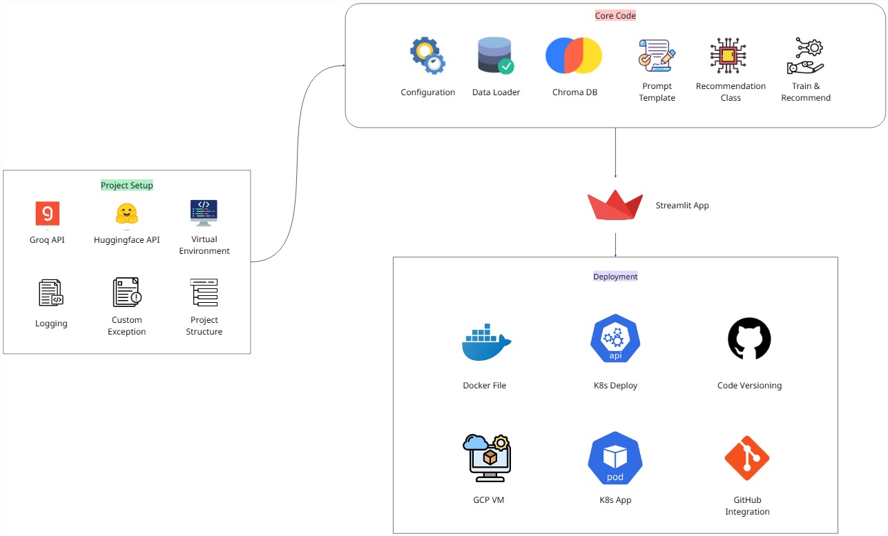

# AI Anime Recommender 📺

An intelligent anime recommendation system powered by LangChain, ChromaDB, and Groq LLM that provides personalized anime suggestions based on user queries.

## 🚀 Features

- **Semantic Search**: Uses vector embeddings to find similar anime based on plot, genre, and themes
- **LLM-Powered Recommendations**: Leverages Groq's Llama 3.1 model for intelligent recommendations
- **Interactive Web Interface**: Clean Streamlit UI for easy interaction
- **Vector Database**: ChromaDB for efficient similarity search
- **Comprehensive Logging**: Detailed logging for monitoring and debugging

## 🛠️ Tech Stack

- **Backend**: Python 3.12+, LangChain, ChromaDB
- **LLM**: Groq (Llama 3.1-8b-instant)
- **Embeddings**: Sentence Transformers (all-MiniLM-L6-v2)
- **Frontend**: Streamlit
- **Database**: ChromaDB (Vector Database)
- **Deployment**: Docker, Kubernetes

## 📋 Prerequisites

- Python 3.12 or higher
- Groq API key
- Git

## ⚡ Quick Start

### 1. Clone the Repository
```bash
git clone <repository-url>
cd ai_anime_recommender
```

### 2. Set Up Environment
```bash
# Create virtual environment
python -m venv ai_env
source ai_env/bin/activate  # On Windows: ai_env\Scripts\activate

# Install dependencies
pip install -r requirements.txt
```

### 3. Configure Environment Variables
Create a `.env` file in the root directory:
```env
GROQ_API_KEY=your_groq_api_key_here
HUGGINGFACE_API_KEY=your_huggingface_api_key_here  # Optional
```

### 4. Run the Application
```bash
streamlit run app/app.py
```

The application will be available at `http://localhost:8501`

## 🐳 Docker Deployment

### Build and Run with Docker
```bash
# Build the image
docker build -t ai-anime-recommender .

# Run the container
docker run -p 8501:8501 --env-file .env ai-anime-recommender
```

### Kubernetes Deployment
```bash
kubectl apply -f llmops-k8s.yaml
```

## 📁 Project Structure

```
ai_anime_recommender/
├── app/                    # Streamlit application
│   ├── app.py             # Main application file
│   ├── style.css          # Custom CSS styles
│   └── img.jpg            # Banner image
├── src/                   # Core source code
│   ├── data_loader.py     # Data loading utilities
│   ├── vector_store.py    # Vector database operations
│   ├── recomender.py      # Recommendation engine
│   └── prompt_template.py # LLM prompt templates
├── pipeline/              # ML pipeline
│   ├── pipeline.py        # Main pipeline orchestration
│   └── build_pipeline.py  # Pipeline building utilities
├── config/                # Configuration files
│   ├── config.py          # Application configuration
│   └── path_config.py     # Path configurations
├── utils/                 # Utility modules
│   ├── logger.py          # Logging configuration
│   └── custom_exception.py # Custom exception handling
├── data/                  # Data files
│   ├── anime_with_synopsis.csv
│   └── processed_anime.csv
├── chroma_db/             # Vector database storage
├── logs/                  # Application logs
├── requirements.txt       # Python dependencies
├── Dockerfile            # Docker configuration
└── README.md             # This file
```

## 🏗️ Project Architecture

The diagram below illustrates the complete workflow of the AI Anime Recommender system — from initial project setup, through the core logic, to deployment.



### **Description**
1. **Project Setup**  
   - **Groq API**: For fast and efficient LLM inference.  
   - **Huggingface API**: For embeddings and model access.  
   - **Virtual Environment**: Isolated development environment.  
   - **Logging** & **Custom Exceptions**: For debugging and error handling.  
   - **Project Structure**: Organized codebase for scalability.  

2. **Core Code**  
   - **Configuration** & **Data Loader**: Setting up parameters and loading datasets.  
   - **ChromaDB**: Vector storage for similarity search.  
   - **Prompt Template**: Pre-defined prompts for the LLM.  
   - **Recommendation Class**: Main recommendation logic.  
   - **Train & Recommend**: Model training and suggestion generation.  

3. **Streamlit App**  
   - Provides an interactive front-end for users to query and receive recommendations.

4. **Deployment**  
   - **Docker** & **Kubernetes (K8s)** for containerized, scalable deployment.  
   - **GCP VM**: Cloud hosting.  
   - **Code Versioning** & **GitHub Integration** for collaboration. 

## 🎯 Usage

1. **Start the Application**: Run `streamlit run app/app.py`
2. **Enter Query**: Type an anime name or description in the search box
3. **Get Recommendations**: Click "Process" to receive personalized recommendations
4. **Explore Results**: View detailed recommendations with explanations

### Example Queries
- "Attack on Titan" - Get similar action anime
- "romantic comedy anime" - Find rom-com recommendations
- "dark fantasy with magic" - Discover fantasy anime with dark themes

## 🔧 Configuration

### Model Configuration
Edit `config/config.py` to modify:
- LLM model (default: llama-3.1-8b-instant)
- Embedding model (default: all-MiniLM-L6-v2)
- API keys and endpoints

### Vector Database
- ChromaDB stores embeddings in `chroma_db/` directory
- Automatically builds vector store on first run
- Persistent storage for fast subsequent queries

## 📊 API Reference

See [API_DOCUMENTATION.md](docs/API_DOCUMENTATION.md) for detailed API specifications.

## 👥 Contributing

1. Fork the repository
2. Create a feature branch (`git checkout -b feature/amazing-feature`)
3. Commit changes (`git commit -m 'Add amazing feature'`)
4. Push to branch (`git push origin feature/amazing-feature`)
5. Open a Pull Request

## 📄 License

This project is licensed under the MIT License - see the LICENSE file for details.

## 👨‍💻 Author

**Neeraj Prasad**
- GitHub: [@neerajprasad209](https://github.com/neerajprasad209)
- LinkedIn: [Neeraj Prasad](https://www.linkedin.com/in/neeraj-prasad-86a89b202/)
- Portfolio: [neerajprasad.netlify.app](https://neerajprasad.netlify.app/)
- Email: neerajprasad.209@gmail.com

## 🙏 Acknowledgments

- LangChain for the RAG framework
- Groq for fast LLM inference
- ChromaDB for vector storage
- Streamlit for the web interface